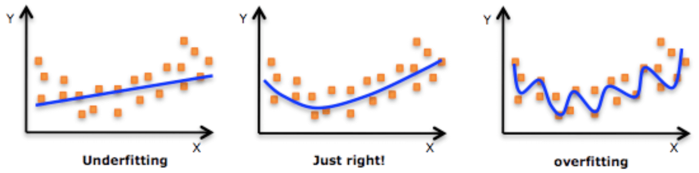

# Does this fit? Fitting mathematical models to data

> image source: http://www.homme-chic.com/wp-content/gallery/longeur-de-manches/

It's  common to want to describe something about the world in mathematical terms. We can take what we know about something, collect data, then build a *mathematical model* of that thing. Mathematical models are rarely correct, but they can be wrong in many ways. Some models **underfit** the data, and others can **overfit** the data. Let's make a simple model and see how it can go wrong. 

**Imagine two people:** Alicia who is 163 cm tall, and Bethany is 64 cm tall. One of them is 16 years old and the other just turned 1. Who is the older one? 

> images adapted from: https://jooinn.com/human-silhouette.html

Too easy! Alicia is older, because we know that most 16 year-olds are taller than most babies. We can extend this idea by making a simple *rule* that relates height to age: people get taller as they get older. I have drawn what we know so far on the graph below. 
- The two points represent Alicia and Bethany
- The line represents the rule we just stated: as age increases, so does height.

Remebering math class, we could take those two points, take the rise over run, and before long could arrive at the formula:

Where $x=age$ and $y=height$. This formula is our **mathematical model** of height and age. If we know someone's age we could calculate their estimated height. This is a very simple model and it has a few problems. 

### Problem 1: It predicts giants!
This model doesn't work well for every age. For example, how tall can you expect to be when you're 50?

The model predicts you will be 401cm tall, which is clearly nonsense. We can save our simple model by incorporating another bit of knowledge: people reach their maximum height at around 20 years old. With that info the model can be refined like this:

### Problem 2: People are different
The model is based on very little information. We only have the data from two people, so we can't expect this to represent all people. What if these two people were super tall or short compared to other people their age? It would give us very unrealistic expectations

> *image source: https://basketballnoise.com/who-is-the-shortest-nba-player/*

To improve the model and account for the many different heights in the world we need MORE DATA! We need to measure more people and find out their age.

Let's pretend we went out and got data from the kids on my block and recorded their heights. Now our data looks like this:

This shows that the situation is more complex. There is no way we can fit a line and have it go through all the points, but that's ok! We can draw a *best-fit line* that goes as close as it can to as many points as possible. 

That looks better. The line doesn't go through many of the points exactly, but it's close to most of them. I used a computer to do this because it's easier and more accurate than eyeballing it, plus it gives the equation of the line, the *mathematical model*.

### Problem 3: People grow at different rates
The model shows that the height increases steadily as time goes by, but in the real world it's not like that. Babies grow quickly, while 18 year-olds' growth has slowed down and almost stopped. With this in mind it doesn't make much sense to model a complex pattern with a straight line. 

The straight line model **underfits** the data, meaning it can't capture the complexity in the data. We can fix this by fitting the data points with a *curvy*  line instead of a straight one.

**Underfitting** is when the model is too simple and can't represent the true shape or pattern in the data.

### How do you make a curvy line in math?
One way to do this is with a polynomial function. If you've heard of a parabola, that's a polynomial. The simplest parabola has the equation $y = x^2$.

 

Here are more examples of polynomials:

A polynomial is made up of a bunch of $x$ terms with exponents and coefficients. These will all make curvy lines, and the bigger the exponent, the wigglier the line can be. Here is what these look like when plotted.

### Polynomial height models

I used the computer again to come up with a best fit curve that is a  parabola, or a polynomial of order $n=2$. This is because the biggest exponent is $2$.

The parabolic ($n=2$) model fits the data much better than the straight line did. The curve is very close to most points, except the **outlier** point at $x = 8$. This seems to be from an 8 year-old who is shorter than a four year-old, so I'm not worried that our model's curve doesn't go close to that point. 

Could we get an even better model that fit the points better if we use a polynomial with higher degree? Why not use $n=3$, $4$, $5$, or even $6$?

The higher the order of the polynomial, the more wiggly and able to be go through all the data points. This seems like a good thing untill you remember that the job of the model is to represent the world, not just hit all the data points. 

Look at the $n=6$ plot. Do you REALLY believe that a typical 17 or 18 year-old is shorter than a typical 14 year-old? No, this model is **overfitting** the data, meaning it is trying too hard fit the points and it has lost its ability to make reasonable predictions.

**Overfitting** is when the model is too complex and is trying so hard to hit every point that it mistakes randomness in the data for a real pattern.

### Detecting underfitting and overfitting
There is no clear line between a good model and one that underfits or overfits, but it is easy to recognize clear cases of each one.

> *image source: https://mrrajeshrai.com/2019/06/16/model-fitting-overfitting-underfitting-and-balanced/*

Which one is worse? It really depends on what you are modelling, but being aware of overfitting and underfitting can help you see if your model is doing a good job of representing the real world.

